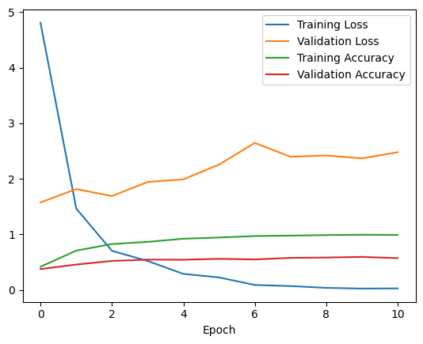

# Instrument Classification and Robustness Analysis

NYU 2026 Colloquy Final Project — A comparative study of classical machine learning (SVM) vs. deep learning (CNN) for musical instrument classification from audio, with cross-domain robustness evaluation.

## Overview

This project classifies five musical instruments — **cello, flute, piano, saxophone, and violin** — from raw audio using MFCC features. Models are trained on the IRMAS dataset (studio recordings) and tested on Freesound (real-world recordings) to evaluate cross-domain generalization.

## Repository Structure

```
instrument--classification-and-robustness-analysis/
├── run_baseline.ipynb          # Main pipeline notebook
├── dataset_preprocessing.py    # Audio loading, MFCC extraction, normalization
├── run_cnn.py                  # CNN architecture definition and inference
├── run_svm.py                  # SVM training and inference wrapper
├── checkpoints/                # Saved Keras model files
├── img/                        # Confusion matrices, loss curves, architecture diagrams
└── mirdata/
    ├── IRMAS-TrainingData/     # Training set (2,766 WAV files)
    └── Freesound-TestData/     # Test set (100 WAV files, 20 per class)
```

## Datasets

| Dataset | Source | Samples | Use |
|---|---|---|---|
| IRMAS | Studio/controlled recordings | 2,766 | Training & validation |
| Freesound | Real-world community recordings | 100 | Test (robustness evaluation) |

**Instrument class distribution (IRMAS):**

| Instrument | Label | Count |
|---|---|---|
| Piano | `pia` | 721 |
| Saxophone | `sax` | 626 |
| Violin | `vio` | 580 |
| Flute | `flu` | 451 |
| Cello | `cel` | 388 |

All audio is standardized to **44.1 kHz, 3-second clips** before feature extraction.

## Feature Extraction

Audio files are converted to **MFCC (Mel-Frequency Cepstral Coefficients)**:

- 128 MFCC coefficients per frame
- Maximum frequency: 8,000 Hz
- Output shape per sample: `(128, 259)` — 128 bins × 259 time frames

MFCCs capture perceptually-weighted spectral characteristics that align with how humans perceive pitch and timbre, making them well-suited for instrument recognition.

## Models

### SVM (Support Vector Machine)

- **Input:** Flattened MFCC array — `(33,152,)` features per sample
- **Kernel:** RBF (default scikit-learn)
- **Training samples:** 2,766

### CNN (Convolutional Neural Network)

- **Input:** `(128, 259, 1)` — preserves 2D spectral structure
- **Architecture:** 3 convolutional blocks

```
Input (128, 259, 1)
  → Conv2D(32) + ReLU → Conv2D(32) + BatchNorm + MaxPool + Dropout(0.2)
  → Conv2D(64) + ReLU → Conv2D(64) + BatchNorm + MaxPool + Dropout(0.2)
  → Conv2D(128) + ReLU → Conv2D(128) + BatchNorm + MaxPool
  → Flatten → Dense(5, softmax)
```

- **Total parameters:** ~615,000
- **Optimizer:** Adam (lr=1e-3)
- **Loss:** Sparse categorical cross-entropy
- **Training samples:** 2,213 (80/20 train/validation split from IRMAS)

## Pipeline

```
1. Load IRMAS audio → create_dataset_csv()
2. Trim & standardize audio → audio_trim(), audio_format_conversion()
3. Extract MFCCs → convert_audio_to_mel_spectrogram()
4. Normalize & split → normalize_split_data()

SVM branch:
  5a. Flatten MFCCs → train_svm() → predict_svm()

CNN branch:
  5b. Reshape for Conv2D → convolutional_model() → train → predict_cnn()

6. Evaluate: accuracy, macro F1, confusion matrix
7. Compare cross-domain generalization (IRMAS val vs. Freesound test)
```

Training callbacks: `ReduceLROnPlateau` (patience=5, factor=0.5) and `EarlyStopping` (patience=10).

## Results

| Model | Validation Accuracy | Test Accuracy (Freesound) | Test F1 (macro) |
|---|---|---|---|
| SVM | ~54% | **54%** | 0.529 |
| CNN | ~68% | **35%** | 0.245 |

### Confusion Matrices

| SVM | CNN |
|---|---|
|  |  |

### Training Loss Curves



### Key Findings

**SVM** generalizes more consistently across domains. Its shallow feature representation limits peak accuracy, but it does not overfit to IRMAS recording conditions.

**CNN** achieves higher validation accuracy but suffers a severe domain shift on Freesound data. Training accuracy reaches ~100% while test accuracy drops to 35%, indicating strong overfitting to IRMAS acoustic characteristics.

The cross-domain gap highlights that model performance on controlled validation data can be misleading. Real-world audio (varying recording conditions, background noise, microphone types) exposes distributional differences that regularization alone does not address.

## Setup

**Dependencies:**

```
librosa
numpy
pandas
scikit-learn
tensorflow / keras
matplotlib
```

Install with:

```bash
pip install librosa numpy pandas scikit-learn tensorflow matplotlib
```

**Dataset:** Download [IRMAS](https://www.upf.edu/web/mtg/irmas) and [Freesound](https://freesound.org/) audio files and place them under `mirdata/IRMAS-TrainingData/` and `mirdata/Freesound-TestData/` respectively. Each subdirectory should be named by instrument label (`cel`, `flu`, `pia`, `sax`, `vio`).

**Run the pipeline:**

Open and execute `run_baseline.ipynb` in Jupyter or VS Code. Pretrained checkpoints are available under `checkpoints/`.

## Limitations and Future Work

- **Overfitting:** The CNN overfits heavily to IRMAS. Data augmentation (pitch shifting, time stretching, additive noise) would improve generalization.
- **Class imbalance:** IRMAS training distribution ranges from 388 (cello) to 721 (piano) samples. Weighted sampling or loss weighting could help.
- **Feature scope:** Experimenting with mel spectrograms, chroma, or spectral contrast alongside MFCCs may capture complementary information.
- **Transfer learning:** Pre-trained audio models (e.g., VGGish, YAMNet) are likely to generalize better to real-world recordings.
- **Robustness testing:** Explicit adversarial tests, noise injection, and tempo/pitch perturbations were not included and would strengthen the robustness analysis.

## References

- Bosch, J. J., Janer, J., Fuhrmann, F., & Herrera, P. (2012). *A Comparison of Sound Segregation Techniques for Predominant Instrument Recognition in Musical Audio Signals.* ISMIR.
- IRMAS Dataset: [https://www.upf.edu/web/mtg/irmas](https://www.upf.edu/web/mtg/irmas)
- Freesound: [https://freesound.org](https://freesound.org)
